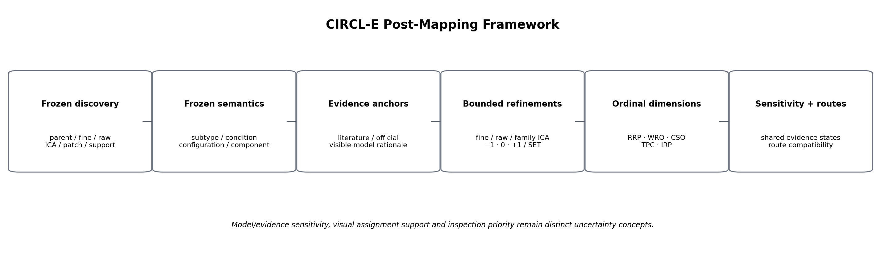
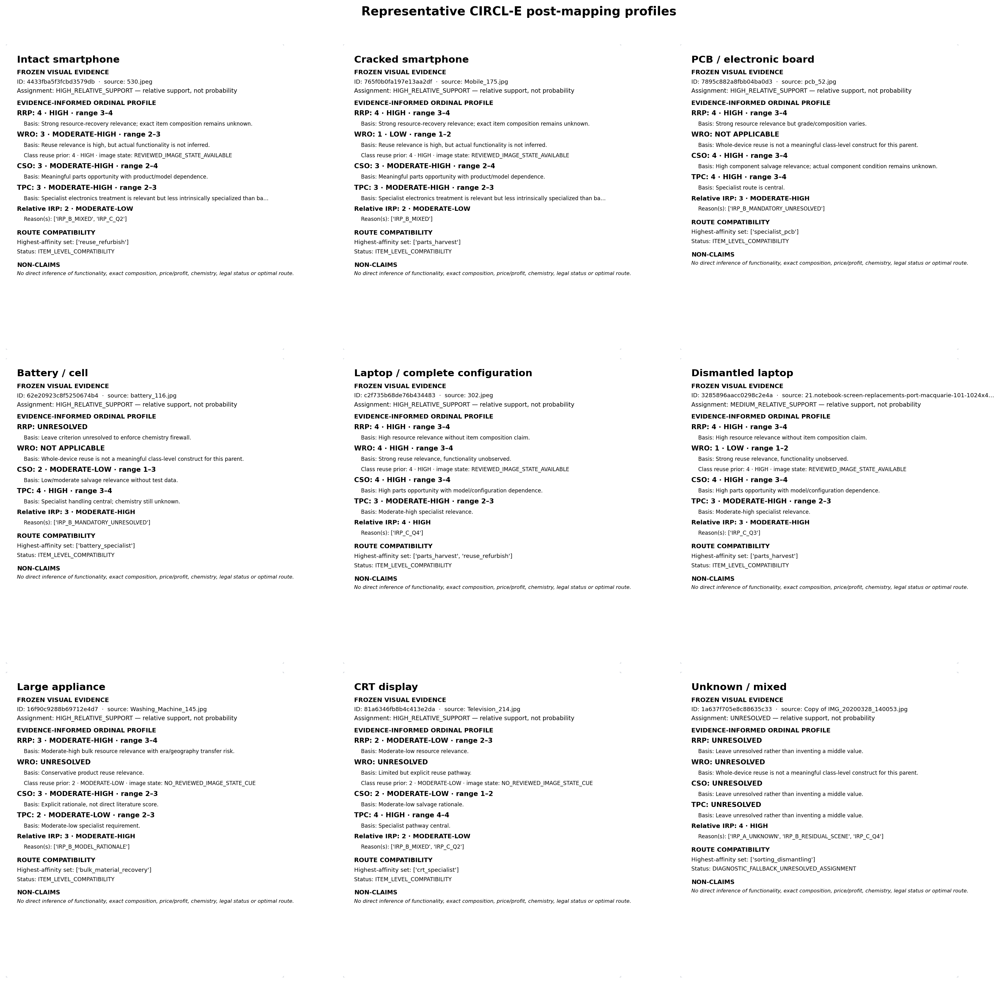

# CIRCL-E

CIRCL-E mengembangkan metode *clustering* dan pembentukan atribut visual untuk citra *e-waste* yang heterogen, kemudian memanfaatkan struktur visual yang ditemukan untuk memberikan saran pengolahan hanya berdasarkan citra. Pendekatan ini tidak mengasumsikan kategori, spesifikasi perangkat, atau kondisi objek di awal: kelompok objek ditemukan langsung dari data tanpa label, dan interpretasi semantik baru dilakukan setelah struktur numerik selesai dibentuk. Repositori ini adalah pendamping kode sumber untuk laporan penelitian Big Data Challenge 2026.

## Dataset dan masalah penelitian

Data berasal dari dataset utama Big Data Challenge 2026 yang memuat citra sampah dalam tiga kelas: *recyclable*, *electronic*, dan *organic*. Analisis dikhususkan untuk mengeksplorasi karakteristik visual dan pengelompokan citra limbah elektronik. Dataset ini memiliki 3.961 citra sampah elektronik, yang dikurasi menjadi 3.793 citra setelah duplikasi dideteksi menggunakan *dHash* dan *pHash*. Sebanyak 3.793 citra hasil kurasi inilah yang menjadi unit analisis CIRCL-E.

Citra *e-waste* di lapangan berasal dari beragam sumber tanpa label spesifik dan rentan terdistorsi oleh karakteristik pengambilan gambar. Penelitian ini merumuskan tiga pertanyaan:

1. Bagaimana menyusun metode *clustering* dan pembentukan atribut berbasis karakteristik citra *e-waste* yang tahan terhadap struktur heterogen serta variasi latar belakang?
2. Bagaimana mengevaluasi klaster yang terbentuk sehingga memastikan bahwa struktur klaster merepresentasikan karakteristik visual objek *e-waste*?
3. Bagaimana memanfaatkan klaster dan karakteristik visual yang ditemukan untuk memberikan saran pengolahan *e-waste* hanya berdasarkan citra?

Secara praktis, metode ini ditujukan untuk membantu tahap awal penerimaan dan pemilahan *e-waste* ketika informasi tentang objek masih terbatas.

## Cara kerja metode

Representasi visual diekstraksi menggunakan dua *backbone* ViT pralatih, C-RADIOv4 dan DINOv3. C-RADIO memberikan representasi global yang menangkap karakteristik semantik keseluruhan citra, sedangkan token spasial DINOv3 membentuk representasi lokal yang menangkap detail tekstur dan morfologi pada bagian objek.

Wilayah *foreground* diestimasi secara *unsupervised* dari token *patch* DINOv3, sehingga objek utama terisolasi dari latar belakang sebelum representasi lanjutan dibentuk. Setiap citra memperoleh representasi pada tampilan utuh maupun hasil pemotongan *foreground*, pada tingkat global maupun lokal. Fitur akuisisi (gaya latar belakang, kecerahan, ketajaman, dan statistik pengambilan gambar) tidak menjadi masukan pembentukan klaster; fitur ini dipakai untuk mengaudit korelasi hasil *clustering* dengan kondisi pengambilan gambar.

Struktur klaster dibentuk secara bertingkat:

- **Klaster induk** — kelompok objek secara umum, dibentuk dengan K-means (K=16) pada representasi global *foreground*. Kandidat algoritma dan konfigurasi lain disaring melalui gerbang kelayakan, dan partisi final dipilih yang keanggotaannya paling sulit ditebak dari fitur akuisisi.
- **Subklaster visual tervalidasi** — subkelompok di dalam klaster induk yang lolos uji individual (resampling, *withholding*, dan korespondensi lintas pandang). Istilah "tervalidasi" menunjukkan reproduktibilitas struktur numeriknya.
- **Daun visual** (*raw visual*) — subkelompok komplementer beresolusi tinggi yang menoleransi variasi pose dan wujud fisik.

Di luar struktur diskret, **atribut visual kontinu** diekstraksi melalui *Independent Component Analysis* (ICA) atas residu histogram konsep visual untuk menangkap variasi yang belum terepresentasi oleh keanggotaan klaster. Interpretasi semantik dilakukan secara manual setelah struktur numerik dibekukan, berdasarkan citra representatif dan metrik pendukung. Terakhir, label semantik dipadukan dengan bukti literatur pengelolaan limbah elektronik untuk membentuk profil saran pengolahan.

## Temuan utama

Ketahanan struktur klaster dievaluasi dari dua sisi:

- **Kontrol negatif latar belakang.** Pengelompokan ulang hanya dari fitur latar belakang menghasilkan ARI 0,096 terhadap partisi induk final — struktur klaster tidak dapat direproduksi dari informasi latar belakang semata.
- **Degradasi visual terkendali.** Enam degradasi pada 160 citra menghasilkan proporsi penugasan yang tetap 0,963–0,994 pada klaster induk dan 0,962–1,000 pada subklaster visual tervalidasi.

Struktur akhir:

| Struktur | Jumlah | Coverage | ARI_g |
|---|---|---|---|
| Klaster induk (K-means, K=16) | 16 | 1,000 | 0,954 |
| Subklaster visual tervalidasi | 28 | 0,653 | 0,981 |
| Daun visual | 48 | 1,000 | 0,961 |

Dari 16 klaster induk, 12 memperoleh status operasional penuh dan dapat digunakan sebagai dasar penyusunan saran pengolahan. Rincian status tiap klaster, hasil atribut kontinu, dan metrik lengkap tersedia di [docs/results.md](docs/results.md).



## Dimensi saran pengolahan

Label semantik dipadukan dengan bukti literatur dan lembaga terkait pengelolaan limbah elektronik untuk membentuk empat dimensi pendukung keputusan, masing-masing pada skala diskret 1–4:

- **RRP** (*Resource Recovery Potential*) — potensi pemulihan sumber daya: relevansi pemulihan material atau komponen.
- **WRO** (*Whole-device Reuse Opportunity*) — peluang penggunaan kembali perangkat secara utuh.
- **CSO** (*Component Salvage Opportunity*) — peluang penyelamatan komponen.
- **TPC** (*Treatment Complexity/Priority*) — kompleksitas atau kebutuhan penanganan khusus.

Profil dibentuk secara hierarkis: nilai acuan tiap kriteria pada tingkat klaster induk ditentukan dari bukti eksternal, kemudian disempurnakan oleh subkelompok visual tervalidasi, daun visual, dan atribut kontinu ICA apabila peran semantiknya relevan. Sebuah dimensi dapat tidak menghasilkan nilai apabila bukti yang tersedia belum mencukupi. Seluruh nilai bersifat ordinal — bukan probabilitas, rasio, atau skor akurasi.

## Contoh: kondisi visual menyempurnakan peluang reuse

Pada klaster induk telepon pintar, WRO memperoleh nilai acuan 4 (tinggi) berdasarkan literatur. Pada penyempurnaan berbasis kondisi visual, 263 citra tanpa kerusakan layar berat memperoleh WRO level 3, sedangkan 89 citra dengan layar retak/pecah memperoleh level 1.

Contoh ini menunjukkan bahwa kondisi fisik yang terlihat dapat menyempurnakan peluang penggunaan kembali perangkat. Nilai tersebut didasarkan pada kondisi visual saat citra diambil, bukan kepastian bahwa perangkat berfungsi atau layak diperbaiki.



## Dashboard

`CIRCL_E_Dashboard_1.0.0/` menyediakan aplikasi Streamlit untuk inferensi pada gambar baru. Aplikasi berjalan sepenuhnya secara lokal dan tidak memerlukan akses internet saat digunakan; *backbone* DINOv3 dan C-RADIOv4 disediakan terpisah pada direktori lokal.

Catatan distribusi: checkout Git publik hanya memuat kode sumber dan konfigurasi dashboard. Direktori `runtime/release/` sengaja tidak disertakan di Git, sedangkan `Dockerfile` mengharapkannya — checkout Git tanpa aset runtime bukan distribusi dashboard yang dapat langsung dijalankan. Paket lengkap `CIRCL_E_Dashboard_1.0.0.zip` dimaksudkan didistribusikan sebagai aset GitHub Release; setelah rilis v1.0.0 terbit, gunakan paket tersebut untuk runtime yang lengkap. Lihat [docs/deployment.md](docs/deployment.md).

## Struktur repositori

```text
CIRCL-E/
├── 01_CIRCL_E_Discovery.ipynb
├── 02_CIRCL_E_Semantic_Mapping.ipynb
├── 03_CIRCL_E_Post_Mapping.ipynb
├── CIRCL_E_STAGE2_EVIDENCE_FIRST_ARTIFACTS/   # artefak Tahap 2: struktur, label semantik, ICA
├── CIRCL_E_Dashboard_1.0.0/                   # kode sumber dan konfigurasi dashboard v1.0.0
├── outputs/                                   # hasil Tahap 3
│   ├── derived/    # profil ordinal, transisi semantik, analisis penghilangan sumber
│   ├── figures/    # figur ilmiah
│   └── report/     # final_methodology.md dan final_results.md
└── docs/           # metodologi, hasil, reproduksibilitas, deployment
```

Ketiga notebook merekam alur eksekusi analisis: pembentukan struktur visual (Tahap 1), pemetaan semantik (Tahap 2), dan pembentukan profil ordinal (Tahap 3).

## Reproduksibilitas dan dokumentasi

| Dokumen | Isi |
|---------|-----|
| [docs/methodology.md](docs/methodology.md) | Metodologi penelitian sebagaimana laporan, plus perluasan implementasi teknis |
| [docs/results.md](docs/results.md) | Hasil dan pembahasan sebagaimana laporan, plus diagnostik implementasi tambahan |
| [docs/reproducibility.md](docs/reproducibility.md) | Environment, urutan eksekusi, dan kebutuhan menjalankan ulang analisis |
| [docs/deployment.md](docs/deployment.md) | Cara memperoleh dan menjalankan dashboard v1.0.0 |
| [CIRCL_E_Dashboard_1.0.0/README.md](CIRCL_E_Dashboard_1.0.0/README.md) | Petunjuk instalasi dashboard (Docker dan Python lokal) |

Handoff antartahap analisis (`CIRCL_E_Discovery_Handoff.zip` dan seterusnya) tidak disimpan di Git dan direncanakan didistribusikan sebagai aset GitHub Release; setelah GitHub Release v1.0.0 diterbitkan, berkas handoff akan tersedia sebagai aset rilis. Detail lingkungan eksekusi ada di [docs/reproducibility.md](docs/reproducibility.md).

## Batasan

Output CIRCL-E adalah profil ordinal berdasarkan penilaian visual. Metode ini tidak menginferensikan fungsionalitas perangkat, berat material, komposisi material, kimia baterai, keberhasilan perbaikan, *yield* pemulihan, nilai pasar, pembayaran *recycler*, profitabilitas, status hukum limbah, klasifikasi bahaya, maupun rute penanganan yang optimal. Klaster residual P00 belum dapat diinterpretasikan secara andal dan tiga klaster induk lain (P02, P09, P13) memerlukan validasi lanjutan. Keluaran saran pengolahan juga bergantung pada cakupan bukti literatur yang digunakan.